# Nationality, Emotion, Age & Color Detection

An end-to-end Streamlit app and training scripts that predict a person's Nationality (proxy via UTKFace race label), Emotion, approximate Age, and Dress Color from a single image using TensorFlow/Keras and OpenCV.

## Features

- Nationality classification (African, Indian, Other, United States)
- Emotion recognition (7 classes)
- Age regression (approximate years)
- Dress color detection (heuristic on clothing region)
- Streamlit web UI with face detection and conditional logic

## Project structure

```
app.py
assets/
models/
    haarcascade_frontalface_default.xml
    (expected) nationality_model.h5, age_model.h5, emotion_model.h5
model_training/
    nationality_training.py
    age_training.py
    emotion_training.py
results/
data/
    UTKFace/
```

## Datasets

1) UTKFace (age, gender, race) for Nationality proxy and Age regression
     - https://susanqq.github.io/UTKFace/
2) FER2013 for Emotion recognition
     - https://www.kaggle.com/c/challenges-in-representation-learning-facial-expression-recognition-challenge

### Ethical note
Race is used as a proxy for Nationality only for a technical demo. This is a simplification with bias and should not be used as a real predictor of nationality.

## Setup (Windows, cmd)

1) Clone
```cmd
git clone https://github.com/Mr-J12/nationality-detection.git
cd nationality-detection
```

2) Install dependencies
```cmd
python -m pip install -r requirements.txt
```

3) Ensure models folder contents
- Place `models/haarcascade_frontalface_default.xml` (already included here).
- Place trained models in `models/` as:
    - `nationality_model.h5`
    - `age_model.h5`
    - `emotion_model.h5`

Note: The training scripts save models relative to their script location. If any model was saved under `model_training/models/`, move it into the top-level `models/` folder so the app can find it.

## Train models (optional)

All scripts run from the repo root.

- Nationality (MobileNetV2 transfer learning on UTKFace race → mapped to 4 classes)
```cmd
python model_training\nationality_training.py
```

- Age (MobileNetV2 regression on UTKFace age)
```cmd
python model_training\age_training.py
```

- Emotion (CNN on FER2013)
```cmd
python model_training\emotion_training.py
```

After training, ensure the resulting `.h5` files are placed in `models/` (top-level) for the app.

## Run the app

```cmd
streamlit run app.py
```
Then open http://localhost:8501 in your browser.

## Results (from training runs)

### Nationality
- Accuracy/Loss curves
    - 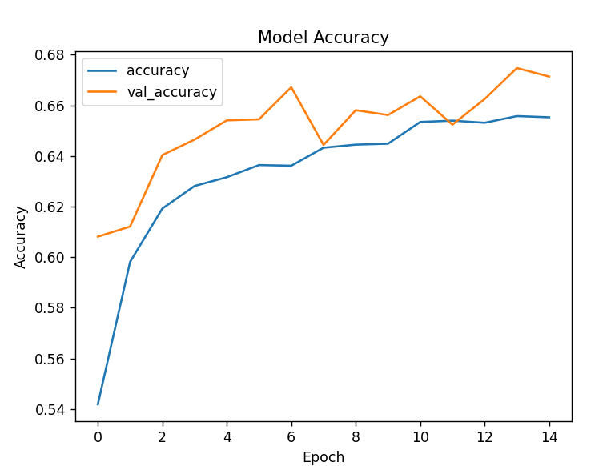
    - 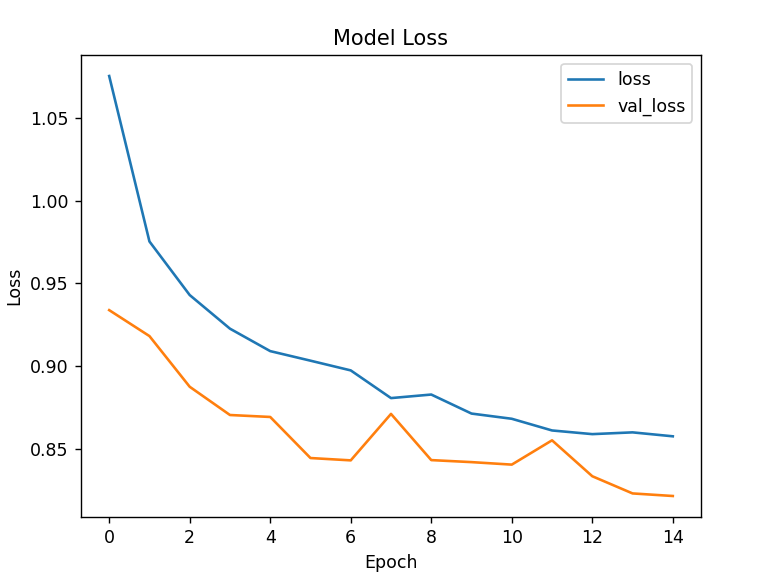
- Confusion Matrix & Report
    - 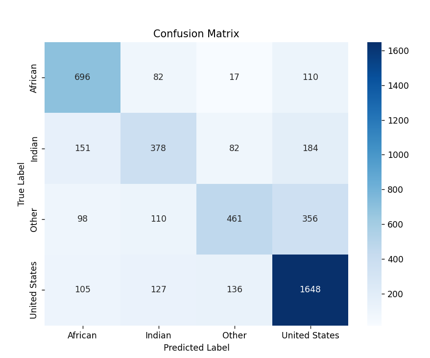
    - 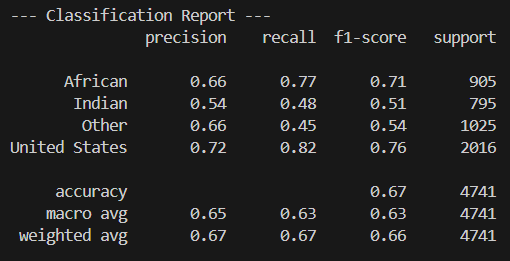
- Class distribution (dataset)
    - 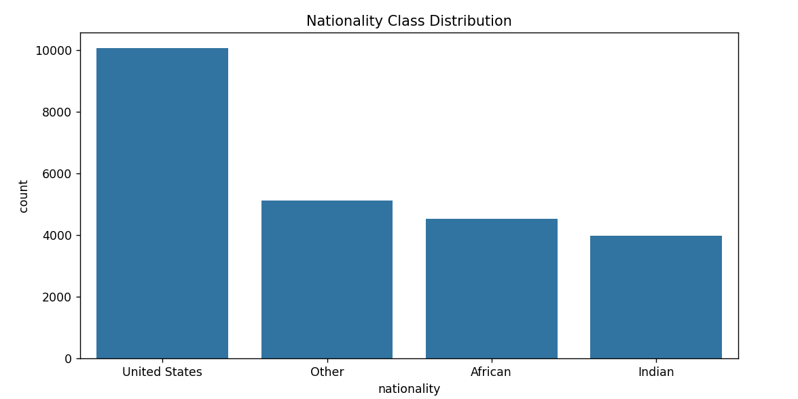

### Emotion
- Accuracy/Loss curves
    - 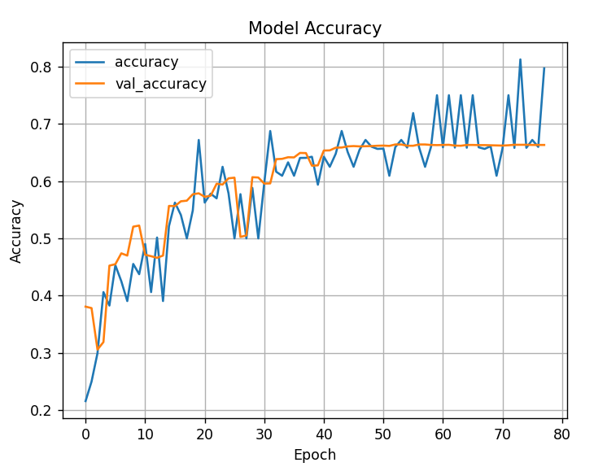
    - 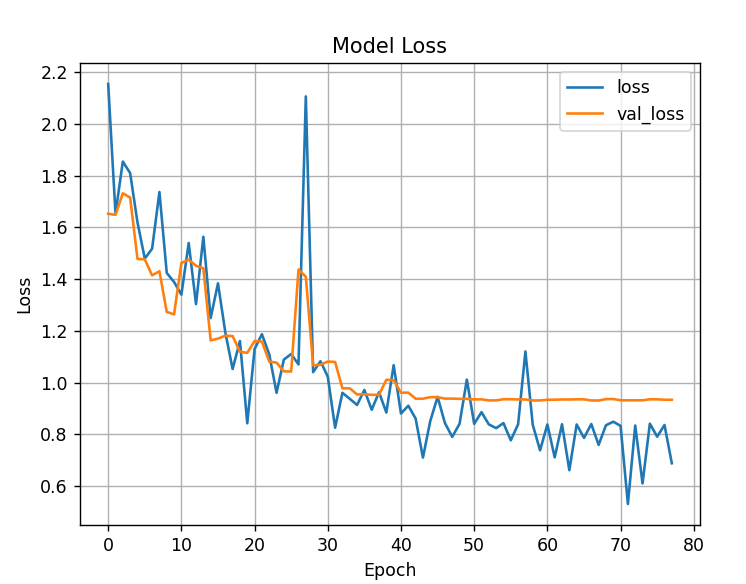
- Confusion Matrix & Report
    - 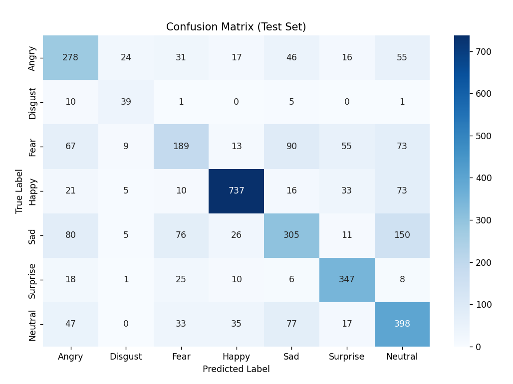
    - 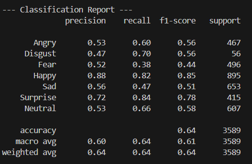

### Age
- Overall metrics/curves
    - 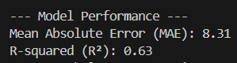
    - 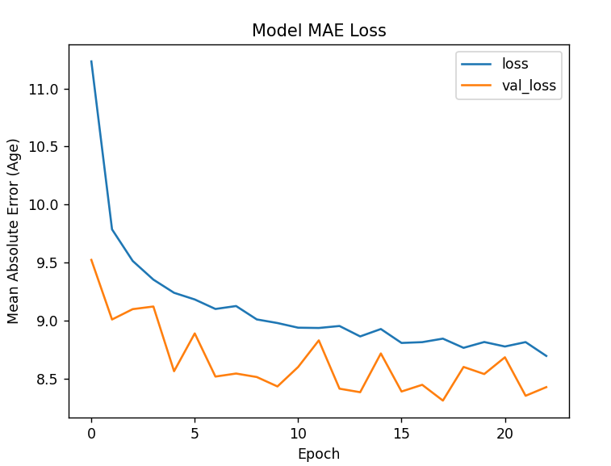
- Scatter plot (Predicted vs True)
    - 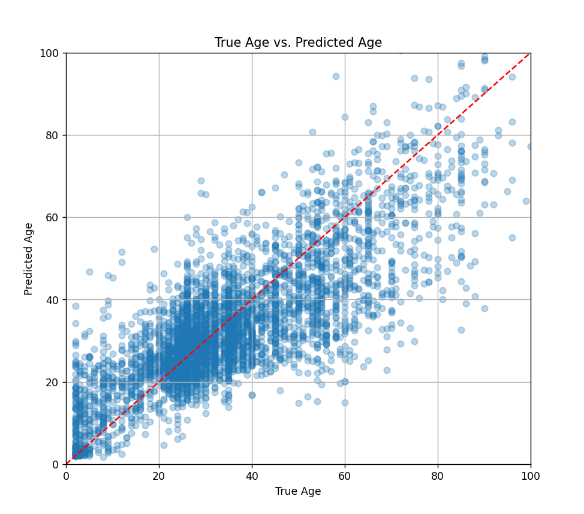

### App screenshots
- 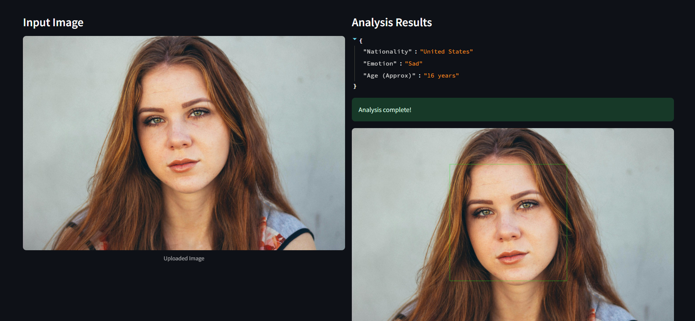
- 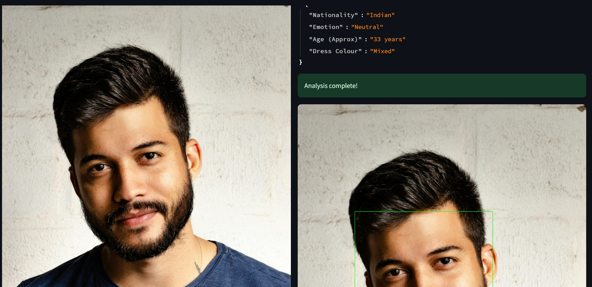
- 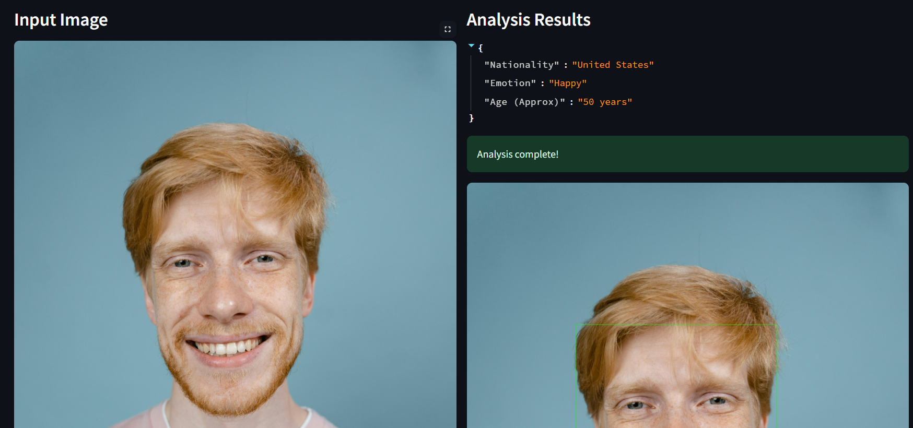

## How it works (high level)
1) Face detection (OpenCV Haar Cascade)
2) Nationality prediction (MobileNetV2 fine-tuned)
3) Emotion prediction (CNN on 48x48 grayscale)
4) Conditional steps:
     - Indian: Age + Dress Color
     - United States: Age only
     - African: Dress Color only
     - Other: None

## Troubleshooting
- TensorFlow import issues in VS Code: ensure the environment you selected has `tensorflow` installed.
- On Windows, use a supported Python version for your TensorFlow release (commonly 3.8–3.11). If install fails, try creating a fresh venv.
- If the app says a model file is missing, place the `.h5` into the top-level `models/` folder.